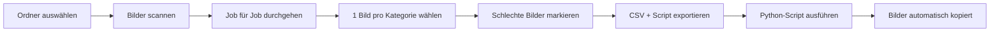

# 🖼️ HeyJobs Bildauswahl Tool

> Effizientes Tool zur Auswahl von Job-Bildern aus Midjourney-Variationen mit integriertem Quality-Control-System für Machine Learning Training.

[](https://DEIN-USERNAME.github.io/heyjobs-bildauswahl-tool/)
[](https://opensource.org/licenses/MIT)

---

## 🚀 Features

- ✅ **Lokale Verarbeitung** – Keine Server, alle Daten bleiben bei dir
- 📊 **Bulk-Auswahl** – Bis zu 1905+ Jobs effizient bearbeiten
- 🎨 **4 Kategorien** – Konsistente Bildauswahl pro Job
- 🚩 **Quality Control** – Schlechte Bilder für ML-Training markieren
- 💾 **Auto-Save** – Fortschritt wird automatisch gespeichert
- 📦 **Export** – CSV, XML, Python-Script
- 🎯 **2×2 Grid** – Alle 16 Bilder auf einem Screen

---

## 🌐 Live Demo

**[👉 Tool jetzt öffnen](https://DEIN-USERNAME.github.io/heyjobs-bildauswahl-tool/)**

> **Hinweis:** Das Tool läuft komplett im Browser. Deine Bilder bleiben lokal auf deinem Rechner und werden **nicht hochgeladen**.

---

## 📖 Quick Start

### 1. **Tool öffnen**
Öffne die [Live-Demo](https://DEIN-USERNAME.github.io/heyjobs-bildauswahl-tool/) in deinem Browser.

### 2. **Bildordner auswählen**
Klicke auf die 4 Ordner-Auswahl-Buttons und wähle deine lokalen Midjourney-Ordner:
- 👨 Junger deutscher Mann
- 👩 Junge deutsche Frau  
- 👴 Ältere deutsche Person
- 🌍 Nicht-deutsche Person

### 3. **Bilder auswählen**
- **Klick auf Bild** → Auswahl (grüner Haken)
- **🔍 Button** → Vollansicht
- **🚩 Button** → Als schlecht markieren (für Training)

### 4. **Exportieren**
```bash
# CSV Auswahl herunterladen
job_image_selections.csv

# CSV Schlechte Bilder herunterladen  
bad_images.csv

# Python-Script herunterladen
copy_images.py
```

### 5. **Bilder kopieren**
```bash
# Script + CSVs in Ordner mit Bildordnern legen
python copy_images.py

# Ergebnis:
# final/ → Ausgewählte Bilder
# bad_images/ → Schlechte Bilder für Training
```

---

## 🎯 Use Cases

### 1. **Job-Bildauswahl**
Schnelle Selektion der besten Bilder aus Midjourney-Variationen für 1905+ Jobs.

### 2. **ML Training Data**
Sammle schlechte Bilder um einen Image-Scoring-Agent zu trainieren:
```
Training Set:
├── Positive Examples (final/)
└── Negative Examples (bad_images/)
```

### 3. **Quality Control**
Übersicht und Export aller markierten schlechten Bilder für Analyse.

---

## 📁 Dateinamen-Format

Das Tool erkennt automatisch Jobs aus folgenden Dateinamen:

```
_ID_<JOB_ID>_ID__<JOBTITEL>[_-_<VARIATION>].<ext>

Beispiele:
✅ _ID_1905_ID__senior_developer_v1.png
✅ _ID_0042_ID__marketing_manager.jpg
✅ _ID_0123_ID__data_analyst_-_variation_2.webp
```

---

## 🛠️ Technologie

| Komponente | Tech Stack |
|------------|------------|
| **Frontend** | HTML5, CSS3, Vanilla JavaScript |
| **Storage** | LocalStorage (Browser) |
| **File API** | FileReader, Blob URLs |
| **Export** | CSV, XML, Python |
| **Layout** | CSS Grid, Flexbox |
| **Fonts** | IBM Plex Sans |

**Keine Dependencies** – Funktioniert offline nach dem ersten Laden!

---

## 📊 Export-Formate

### CSV Auswahl
```csv
Job-ID,Jobtitel,Junger deutscher Mann,Junge deutsche Frau,...
123,"Software Engineer","image_v2.png","image_v1.png",...
```

### CSV Schlechte Bilder
```csv
Job-ID,Jobtitel,Kategorie,Bildname,Ordner
123,"Software Engineer","Junger deutscher Mann","image_v5.png","junger_deutsche"
```

### XML
```xml
<job-image-selections>
  <job id="123">
    <title>Software Engineer</title>
    <images>
      <image category="junger_deutsche">image_v2.png</image>
      ...
    </images>
  </job>
</job-image-selections>
```

---

## 🎨 Screenshots

### Hauptansicht

*2×2 Grid – Alle 16 Bilder auf einem Screen*

### Bildauswahl

*Grüner Haken = Ausgewählt | Rote Flagge = Schlecht*

### Export

*CSV + Python-Script Download*

---

## 🔒 Datenschutz & Sicherheit

- ✅ **Keine Server-Uploads** – 100% lokale Verarbeitung
- ✅ **Keine Tracking-Scripts**
- ✅ **Keine Cookies**
- ✅ **Open Source** – Code einsehbar
- ✅ **Browser-Storage** – Daten bleiben auf deinem Gerät

**Deine Bilder verlassen niemals deinen Computer!**

---

## 💻 Lokale Entwicklung

```bash
# Repository klonen
git clone https://github.com/DEIN-USERNAME/heyjobs-bildauswahl-tool.git
cd heyjobs-bildauswahl-tool

# Einfach index.html öffnen
# Keine Build-Tools nötig!

# Oder lokalen Server starten (optional):
python -m http.server 8000
# → http://localhost:8000
```

---

## 📦 Dateistruktur

```
heyjobs-bildauswahl-tool/
├── index.html                    # Hauptanwendung
├── README.md                     # Diese Datei
├── LICENSE                       # MIT Lizenz
├── docs/
│   ├── DOKUMENTATION.md          # Ausführliche Doku
│   └── screenshots/              # Screenshots
└── examples/
    ├── copy_images.py            # Beispiel-Script
    └── sample_data.csv           # Beispiel-Export
```

---

## 🎯 Workflow



---

## 🚀 Performance

- ⚡ **~3-4 Sekunden** pro Job
- 📊 **1905 Jobs** in ~2,5 Stunden
- 💾 **Kein Memory-Leak** – Blob URLs werden aufgeräumt
- 🎨 **Responsive** – Desktop, Tablet, Mobile

---

## 🐛 Troubleshooting

### Problem: "Keine Jobs gefunden"
**Lösung:** Prüfe Dateinamen-Format:
```
✅ _ID_123_ID__jobtitle.png
❌ job_123.png
```

### Problem: Browser fragt nach Upload
**Antwort:** Das ist normal! Der Browser fragt nach Permission für lokalen Ordner-Zugriff. Deine Dateien werden **nicht** hochgeladen.

### Problem: Fortschritt verloren
**Lösung:** Cache wurde gelöscht oder Browser-Daten geleert. Nutze regelmäßig den Export!

### Problem: Script findet Bilder nicht
**Lösung:** 
```bash
# Ordnerstruktur prüfen:
/dein-ordner/
  ├── copy_images.py
  ├── job_image_selections.csv
  ├── bad_images.csv
  ├── junger_deutsche/
  ├── junge_deutsche/
  ├── ältere_deutsche/
  └── nicht_deutsch/
```

---

## 🤝 Contributing

Contributions sind willkommen! 

1. Fork das Repository
2. Erstelle einen Feature-Branch (`git checkout -b feature/amazing-feature`)
3. Commit deine Changes (`git commit -m 'Add amazing feature'`)
4. Push zum Branch (`git push origin feature/amazing-feature`)
5. Öffne einen Pull Request

---

## 📝 Lizenz

Dieses Projekt ist lizenziert unter der **MIT License** – siehe [LICENSE](LICENSE) für Details.

---

## 🙏 Acknowledgments

- **IBM Plex Sans** – Font von IBM
- **HeyJobs GmbH** – Corporate Design & Farben
- **Midjourney** – Bildgenerierung

---

## 📞 Support

- 📖 [Ausführliche Dokumentation](docs/DOKUMENTATION.md)
- 🐛 [Issues melden](https://github.com/DEIN-USERNAME/heyjobs-bildauswahl-tool/issues)
- 💬 [Diskussionen](https://github.com/DEIN-USERNAME/heyjobs-bildauswahl-tool/discussions)

---

## ⭐ Star History

Wenn dir das Tool hilft, gib uns einen Star! ⭐

[](https://star-history.com/#DEIN-USERNAME/heyjobs-bildauswahl-tool&Date)

---

**Erstellt mit ❤️ für HeyJobs GmbH**

*Version 1.0 | 2026 | [Live Demo](https://DEIN-USERNAME.github.io/heyjobs-bildauswahl-tool/)*
